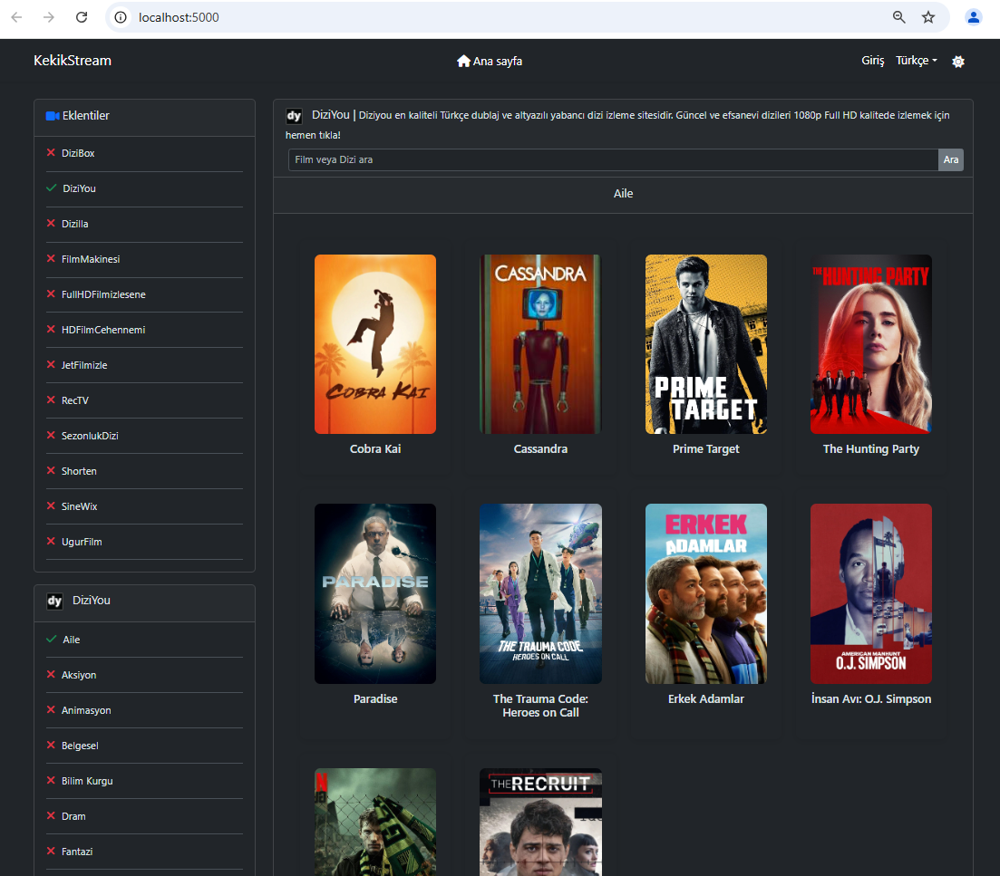
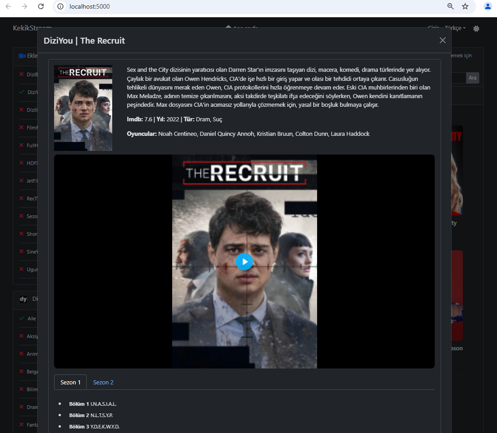
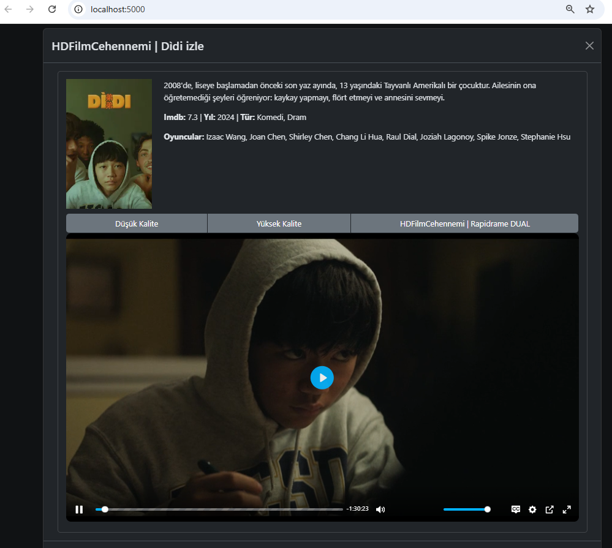

# KekikStream.Webtop

**⚠️ Bu proje daha fazla geliştirilmeyecektir. Meraklısı ve eklenti geliştiricileri için çok yakında: [MediaManiac](https://github.com/MediaManiacs)  **

## KekikStream Web Tabanlı Desktop Uygulama

[KekikStream](https://github.com/keyiflerolsun/KekikStream) ve [KekikStreamAPI](https://github.com/keyiflerolsun/KekikStreamAPI) ile entegre web tabanlı cross platform masaüstü uygulaması

### Uyarı!
Windows kullanıcıları [burada](https://github.com/keyiflerolsun/KekikStreamAPI/issues/4) ve [burada](https://github.com/keyiflerolsun/KekikStreamAPI/issues/1) bahsedilen sorunları incelemeleri gerekir.

### Bağımlılıklar

* [.NET9.0+ SDK](https://dotnet.microsoft.com/download/dotnet)
* [Python 3.10+](https://www.python.org/)

### Nasıl çalışır

* install python
* pip install KekikStream
* pip install -U KekikStream
* start KekikStreamAPI

https://github.com/serdar-sahin/kekikstream-webtop/releases

windows kullanıcıları: KekikStream.Webtop.Blazor.exe

linux ve macos kullanıcıları: dotnet KekikStream.Webtop.Blazor.dll

http://localhost:5000

## Teşekkürler:

+ [KekikStream](https://github.com/keyiflerolsun/KekikStream) 
+ [KekikStreamAPI](https://github.com/keyiflerolsun/KekikStreamAPI)
+ [ABP](https://github.com/abpframework/abp)
+ Ve daha niceleri... 

## Ekran Görüntüleri

